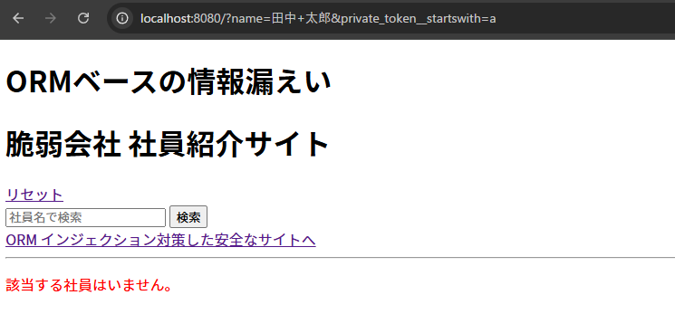
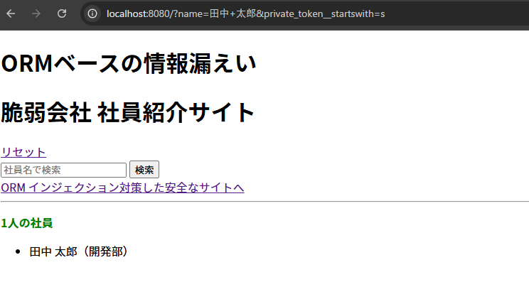
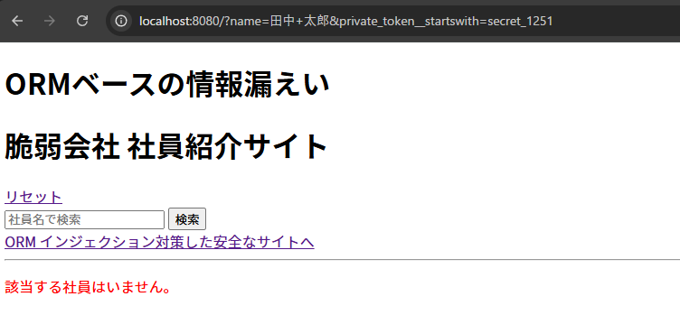
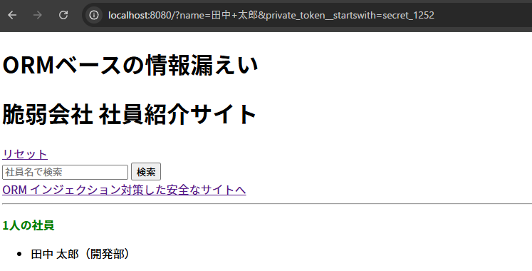
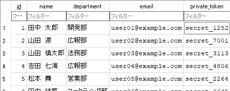
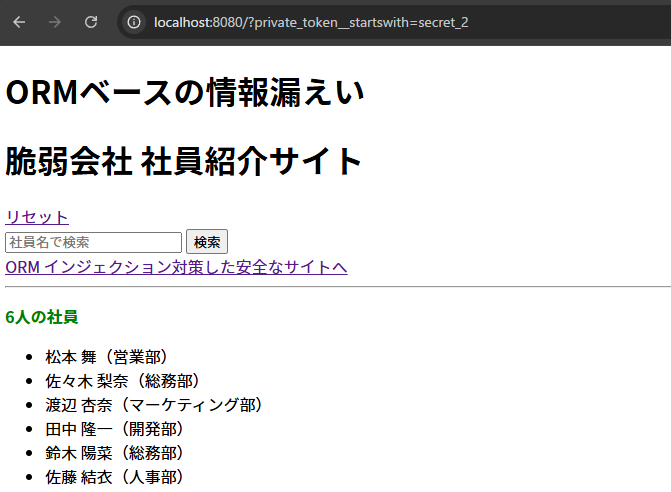

# Django ORM Leak Lab

このプロジェクトは、Django の ORM に潜む「ORM Leaking（ORM インジェクション）」脆弱性を検証・再現するためのデモアプリケーションです。

PortSwiggerの「[Top 10 web hacking techniques of 2025](https://portswigger.net/research/top-10-web-hacking-techniques-of-2025)」で第2位に選出された手法をベースにしています。</br>
SQLインジェクション対策がなされている現代的な Web アプリにおいても、ORM の不適切な利用が致命的な情報漏洩に繋がることを示します。

---

## 🔧 技術スタック

- Python 3.12-slim
- Django 5.x / 6.x
- SQLite3
- Docker / Docker Compose

## 🚀 セットアップ

Docker が使える環境で以下を実行します。

```bash
git clone <リポジトリURL>
cd Django-ORM-Leak-Lab
docker compose up -d --build
```

データベースを初期化し、サンプルデータを投入します。

```bash
docker compose exec django python manage.py migrate
docker compose exec -T django python manage.py shell < src/main/seed.py
```

サイトにアクセス</br>
http://localhost:8080


---

## 🔍 脆弱性の解説

脆弱な実装は `main/views.py` にあります。

```python
def index(request):
    query_params = request.GET.dict()
    # 【脆弱性の原因】ユーザー入力を検証せずに ORM の引数として展開している
    results = Employee.objects.filter(**query_params)
    return render(request, 'main/index.html', {'results': results})
```

`request.GET` の内容をそのまま `filter(**query_params)` に渡すと、`__startswith` などの Django ルックアップを攻撃者に悪用され、意図しないカラムで検索される可能性があります。

---

## 🎯 攻撃シナリオ

攻撃者は `private_token` というカラムの存在を推測、特定したと仮定します。
1. 初期状態: 攻撃者は「田中 太郎」のトークンを一切知りません。

2. ブルートフォース攻撃: `__startswith` などのルックアップを利用したURLを生成します。

   `/?name=田中 太郎&private_token__startswith=a` -> 「0件」

   `/?name=田中 太郎&private_token__startswith=s` -> 「1件見つかりました」

3. 推論: サーバーの応答（真偽値）を観察することで、トークンを一文字ずつ特定（リーク）させます。

   ```text
   /?name=田中 太郎&private_token__startswith=a
   /?name=田中 太郎&private_token__startswith=s
   ```

- `a` の場合: `0件`
- `s` の場合: `1件`

上記を繰り返すことで、secret_1252 のような機密情報を完全に特定します。

### 画像付き解説
   ```text
   /?name=田中 太郎&private_token__startswith=a
   ```
   最初の文字はaではないと確定
   ↓
   b→c→dと地道に試していく</br>

   ```text
   /?name=田中 太郎&private_token__startswith=s
   ```
   ここでsがヒット！ → 次の文字でこれをまた繰り返す</br>

   ```text
   /?name=田中 太郎&private_token__startswith=secret_1251
   ```
   1251でだめなら1252で、、、</br>

   ```text
   /?name=田中 太郎&private_token__startswith=secret_1252
   ```
   1252でヒット！次の文字で全通り試してヒットしなかったらこれで特定完了だろうと推測</br>
</br>
   実際にデータベースを見てみると、、、</br>
   カラム名`private_token`で田中太郎の private_tokeはsecret_1252 であってる！</br>
</br>
   もちろん田中 太郎に絞らなくても`private_token`がsecret_2で始まる人を探すこともできます
   ```text
   /?private_token__startswith=secret_2
   ```

---

## 🛡️ 対策

「`カラム名 = 値` で書く方法」

```python
name = request.GET.get('name')

results = Employee.objects.all()
results = results.filter(name=name)
```

`private_token` なんてコードに書いていない以上、外部から何を送り込まれても絶対に漏洩しません。
